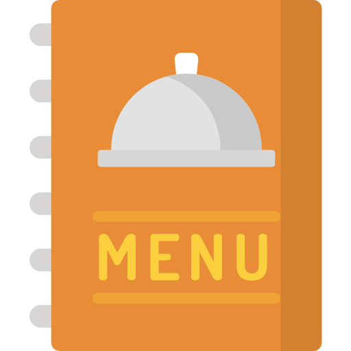

#  Menu Engineering & Sales Optimization

This project analyzes restaurant POS data to uncover high- and low-performing menu items using the **Menu Engineering Matrix** — then models strategic interventions to increase profitability.

---

## Objectives

- Classify menu items into **Stars**, **Plowhorses**, **Puzzles**, and **Dogs**
- Analyze time-based trends (e.g. weekday vs weekend behavior)
- Simulate real-world strategies like:
  - Boosting sales for high-potential items
  - Price adjustments for high-volume low-margin items
  - Marketing spend allocation and ROI modeling

---

## What’s Inside

- **Data simulation** for 30 days across 13 menu items  
- **Profit margin and revenue calculations**  
- **Menu Engineering classification** logic  
- **Daily + weekly sales trend insights**  
- **Scenario simulations** for marketing and pricing impact  
- **Net profit analysis** after marketing costs  

---

## Results

- Naive approach (removing Dogs) dropped profits by **–9.7%**
- Strategic scenario improved profits by **+8.07%**
- After marketing costs: **+5.83% net profit uplift**

---

## Key Insight

> Data-informed menu adjustments can lead to **measurable, strategic gains** — outperforming gut-feel decisions and unlocking untapped profit through targeted sales & pricing moves.

---

## 🛠 Tech Stack

- Python (Pandas, NumPy, Matplotlib)
- Jupyter Notebook

---

## 📂 Structure

```bash
menu-engineering-project/
├── index.ipynb       # Full notebook with EDA, logic & simulation
├── README.md         # Project summary and context
└── data/             # directory for exported simulation data

